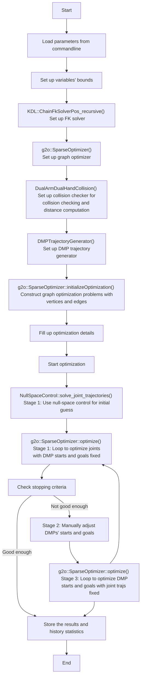

## Motion Retargeting for Dual-Arm Motions

[](http://arxiv.org/abs/2011.03914)[](https://www.youtube.com/watch?v=jPvrAsN1Iwk&t=7s)[](https://opensource.org/licenses/MIT)

This is the code for the paper [_"Dynamic Movement Primitive based Motion Retargeting for Dual-Arm Sign Language Motions"_](http://arxiv.org/abs/2011.03914) accepted by ICRA 2021.

Bilibili Video: [_Click Here_](https://www.bilibili.com/video/BV12i4y1K76G/)


### Contents

* `Docker` Docker files for setting up the environment.
* `arm_hand_capture` Launch files and scripts for recording and post-processing motion capture data of arms and fingers. 

* `arm_hand_retargeting`Retargeting code, along with tools including collision checking, distance computation, etc.

* `dataglove_calib_visual` Visualize recorded hand movements on Inspire Hand or Shadow Hand models.
* `doc` Doxygen stuff.
* `dual_ur5_control`, `dual_ur5_moveit_config` Dual UR5 robot model and MoveIt configuration package.
* `dynamic_reconfigure` Dynamic reconfigure.
* `human_model*` Human model for visualizing recorded movements.
* `inspire_hand_*` Inspire Hands' models, drivers and MoveIt configuration.
* `raw_totg` ROS Wrapper of Time-Optimal Path Parameterization code.
* `realtime_motion_retargeting`
* `sign_language_robot_*` MoveIt configuration and scripts for controlling the sign language robot (Dual UR5 plus Inspire Robot Hand \* 2). 
* `universal_robot`, `ur5_moveit_config`, `ur_*` UR robot stuff.
* `yumi`, `yumi_control`: ABB YuMi stuff.
* `yumi_description`, `yumi_sign_language_robot_*`: YuMi robot model (with Inspire Hands), MoveIt configurations and scripts for controlling it.


### Data Preparation
We use OptiTrack Motive and Wiseglove for recording human arm motions and finger movements. For further details, please refer to ```arm_hand_capture/README.md.```


### Dependencies
For data collection:
usb_cam  
vrpn_client_ros  
rosserial_server  


### Code Procedure

main file: `arm_hand_retargeting/src/yumi_arm_retarget_g2o_similarity.cpp`




### Refactor

* **Goals**

  * Modular

    Load different retargeting or imitation learning methods to obtain results.

  * Multi-modal

    Not restricted to joint trajectories or Cartesian trajectories.

  * More input way

    Easy to load human motion data, either from files or ROS interfaces.

  * ROS independent

    Separate the core from ROS, especially from specific collision checking implementation, and add support for ROS1/ROS2.

* **Framework**

*TODO*

* **UML design**

*TODO*


### Citation

If you find the paper helpful or use our source code, please cite the following:

```latex
@inproceedings{lyw2021dmp,
  title={Dynamic Movement Primitive Based Motion Retargeting for Dual-Arm Sign Language Motions},
  author={Liang, Yuwei and Li, Weijie and Wang, Yue and Xiong, Rong and Mao, Yichao and Zhang, Jiafan},
  booktitle={2021 IEEE International Conference on Robotics and Automation (ICRA)},
  pages={8195--8201},
  year={2021},
  organization={IEEE}
}
```


### FAQ
1. Error “sh: 1: v4l2-ctl: not found” requires the installation of v4l2, run ```sudo apt-get install v4l-utils```
